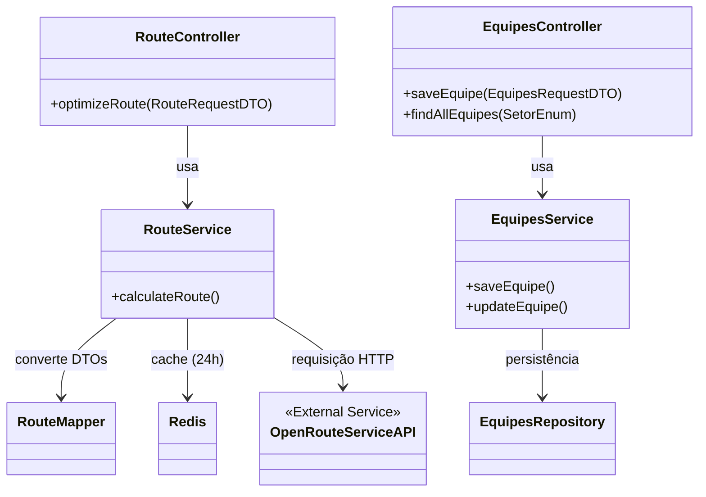

# 🚚 GeoRoute API

<p align="center">
  <a href="#-sobre-o-projeto">Sobre</a> •
  <a href="#-tecnologias-utilizadas">Tecnologias</a> •
  <a href="#-arquitetura-e-estrutura">Arquitetura</a> •
  <a href="#-instalação-e-configuração">Instalação</a> •
  <a href="#-documentação-interativa-swagger">Documentação</a> •
  <a href="#-endpoints-da-api">Endpoints</a> •
  <a href="#-observabilidade">Observabilidade</a>
</p>


## 📖 Sobre o Projeto

Esta é uma API RESTful robusta desenvolvida para auxiliar em processos logísticos da Sipel. O sistema centraliza o cadastro e consulta de informações de clientes (instalação, conta contrato, geolocalização), gerenciamento de equipes e oferece integração inteligente para otimização de rotas.

O projeto foi desenhado com foco em **Alta Disponibilidade** e **Observabilidade**, incluindo suporte nativo a métricas de negócio.

## 🚀 Tecnologias Utilizadas

O projeto utiliza uma stack moderna baseada no ecossistema Spring:

- **Java 21**: Linguagem base (LTS).
- **Spring Boot**: Framework principal para desenvolvimento ágil.
- **Spring Data JPA**: Abstração de persistência de dados.
- **Flyway**: Versionamento e migração de banco de dados.
- **MapStruct**: Mapeamento performático entre Entidades e DTOs.
- **SpringDoc OpenAPI (Swagger)**: Documentação interativa e padronizada da API.
- **Redis**: Caching distribuído para alta performance.
- **OpenCSV**: Processamento assíncrono de grandes volumes de dados (Importação).
- **WebClient (WebFlux)**: Consumo de APIs externas de forma eficiente.
- **OpenRouteService (ORS)**: Motor de otimização de rotas logísticas.
- **Micrometer/Prometheus**: Coleta de métricas de aplicação e negócios.
- **Docker & Docker Compose**: Orquestração de containers (DB, Cache, Monitoramento).

## ⚙️ Arquitetura e Estrutura

A aplicação segue uma arquitetura em camadas clássica e limpa:

```text
src/main/java/com/sipel/backend/
├── controllers/         # Endpoints REST (Exposição)
├── services/            # Lógica de Negócios
├── domain/              # Entidades JPA e Enums
├── repositories/        # Acesso a Dados (Spring Data)
├── mappers/             # Conversores (Entity <-> DTO)
├── dtos/                # Objetos de Transferência de Dados
└── infra/               # Infraestrutura (CSV, Configurações, Segurança)
```

### Diagrama de Dependências

Abaixo, a relação entre os componentes do novo módulo de rotas:



## 🛠️ Instalação e Configuração

### 🚀 Produção (Railway)

Para o deploy no Railway:
1. A aplicação utiliza o perfil `prod` via `Procfile`.
2. Configure a variável `ORS_API_KEY` no painel do Railway.
3. Utilize os **Add-ons nativos** do Railway para PostgreSQL e Redis.
4. A observabilidade é feita de forma nativa pelo painel do Railway (Metrics/Logs).

### 💻 Desenvolvimento Local

#### Pré-requisitos
- **Java 21** instalado.
- **Docker** e **Docker Compose** instalados.
- Chave de API do OpenRouteService.

#### Passo a Passo

1. **Clone o repositório**
   ```bash
   git clone <url-do-repositorio>
   cd backend
   ```

2. **Suba a Infraestrutura Local**
   ```bash
   docker-compose up -d
   ```

3. **Configuração de Variáveis de Ambiente**
   
   **Linux/Mac:**
   ```bash
   export DB_USERNAME=seu_usuario
   export DB_PASSWORD=sua_senha
   export ORS_API_KEY=sua_chave_ors
   ```

4. **Compile e Execute**
   ```bash
   ./mvnw clean install
   ./mvnw spring-boot:run
   ```

## 📚 Documentação Interativa (Swagger)

- **Swagger UI**: [http://localhost:8080/swagger-ui/index.html](http://localhost:8080/swagger-ui/index.html)

## 🔌 Endpoints da API

### 👤 Clientes
| Método | Rota | Descrição |
|---|---|---|
| `POST` | `/api/v1/clientes` | Cadastra um novo cliente |
| `POST` | `/api/v1/clientes/import` | Importação em massa via arquivo CSV (Async) |
| `GET` | `/api/v1/clientes/instalacao/{id}` | Busca por Número de Instalação |

### 👥 Equipes
| Método | Rota | Descrição |
|---|---|---|
| `POST` | `/api/v1/equipes` | Cadastra uma nova equipe |
| `GET` | `/api/v1/equipes` | Lista equipes (filtro opcional por `setor`) |
| `PUT` | `/api/v1/equipes/{id}` | Atualiza dados de uma equipe |
| `DELETE` | `/api/v1/equipes/{id}` | Remove uma equipe |

### 🛣️ Rotas
| Método | Rota | Descrição |
|---|---|---|
| `POST` | `/api/v1/routes/optimize` | Calcula a rota otimizada para uma equipe e lista de clientes |

### 🔐 Autenticação & Usuários
| Método | Rota | Descrição |
|---|---|---|
| `POST` | `/api/v1/auth/login` | Autentica um usuário e retorna um token JWT |
| `POST` | `/api/v1/user/register` | Cadastra um novo usuário |

### 🗺️ Mapas
| Método | Rota | Descrição |
|---|---|---|
| `GET` | `/api/v1/maps/redirect` | Redireciona para o Google Maps |

## 📊 Observabilidade

- **Grafana:** `http://localhost:3000`.
- **Prometheus:** `http://localhost:9090`.

## 🤝 Contribuição

1. Faça um Fork do projeto
2. Crie uma Branch para sua Feature (`git checkout -b feature/NovaFeature`)
3. Abra um Pull Request

---
<p align="center">
  Desenvolvido para <strong>Sipel Construções LTDA</strong>
</p>
